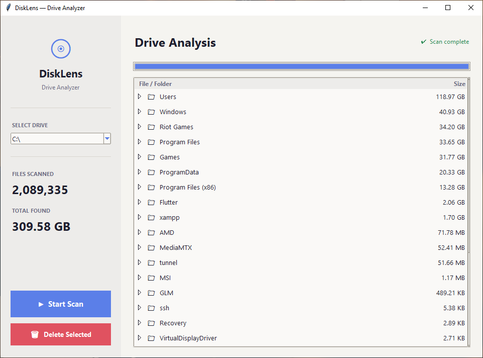

# 💿 DiskLens — Drive Analyzer

A lightweight, open-source Windows desktop app to visualize what's eating up your disk space — with a clean, modern UI and zero external dependencies.


---

## ✨ Features

- 📂 **Collapsible folder tree** — browse your drive like a file explorer, sorted largest-first
- 📊 **Live scan stats** — see files scanned and total GB found in real time as it runs
- 🖱️ **Multi-select & delete** — hold `Ctrl` or `Shift` to select multiple items and delete them in one click
- 💽 **Any drive** — scan any connected drive (C:, D:, USB, etc.) from a dropdown with volume labels
- 🔒 **Admin privileges auto-request** — prompts for UAC elevation on launch for full access
- 🚫 **No dark magic** — nothing is ever deleted unless YOU click Delete and confirm the warning
- 🪶 **Zero dependencies** — built entirely with Python's standard library (`tkinter`, `os`, `shutil`)

---

## 📸 Screenshot



---

## 🚀 Getting Started

### Option 1 — Download the EXE (No Python needed)

1. Go to the [Releases page](https://github.com/joynalbokhsho/DiskLens/releases)
2. Download **`DiskLens.exe`** from the latest release
3. Double-click to run

> **⚠️ Windows SmartScreen Warning:** Windows may show a warning saying *"DiskLens.exe isn't commonly downloaded"*. This is normal for new open-source apps without a paid code-signing certificate. Click **"More info" → "Run anyway"** to proceed. The app is fully open-source and safe to inspect.

### Option 2 — Run from source (Python required)

**Requirements:**
- **Windows** 10 or 11
- **Python 3.8+** — [Download here](https://www.python.org/downloads/) *(check "Add Python to PATH" during install)*

```bash
# 1. Clone the repository
git clone https://github.com/joynalbokhsho/DiskLens.git
cd DiskLens

# 2. Run the app
py disklens.py
```

No `pip install`, no virtual environment, no setup needed.

> **Tip:** On first launch, Windows will ask for Administrator permission via UAC. Click **Yes** for full drive access.

---

## 🖥️ How to Use

| Step | Action |
|---|---|
| 1 | Select the drive you want to scan from the **dropdown** in the sidebar |
| 2 | Click **▶ Start Scan** and wait for the scan to complete |
| 3 | Click the **▶** arrow next to any folder to expand it and see what's inside |
| 4 | Click an item (or use `Ctrl+Click` / `Shift+Click` for multiple) |
| 5 | Click **🗑 Delete Selected** and confirm the warning to permanently remove it |

---

## ⚠️ Safety

DiskLens is **read-only by default**. It never modifies, moves, or deletes any file automatically.

Deletion **only** happens when:
1. You manually select a file or folder
2. You click the **Delete Selected** button
3. You read and confirm the **permanent deletion warning**

> Do not delete system folders like `Windows`, `System32`, or `Program Files` unless you know exactly what you're doing.

---

## 🏗️ Project Structure

```
DiskLens/
├── disklens.py      # Single-file app — all logic and UI in one place
├── screenshot.png   # README screenshot
├── .gitignore
└── README.md
```

---

## 🤝 Contributing

Contributions are welcome! Feel free to:

- 🐛 [Report a bug](https://github.com/joynalbokhsho/DiskLens/issues/new)
- 💡 [Request a feature](https://github.com/joynalbokhsho/DiskLens/issues/new)
- 🔧 Submit a pull request

Please open an issue first to discuss any major changes.

---

## 📄 License

This project is licensed under the **[MIT License](LICENSE)** — feel free to use, modify, and distribute it.

---

## 🙏 Acknowledgements

Built with Python's built-in `tkinter` library — no third-party packages required.
